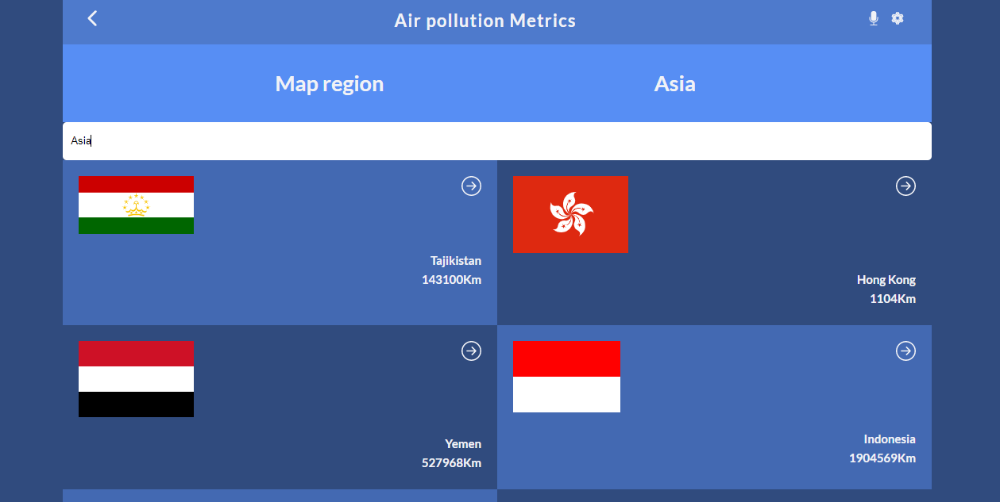
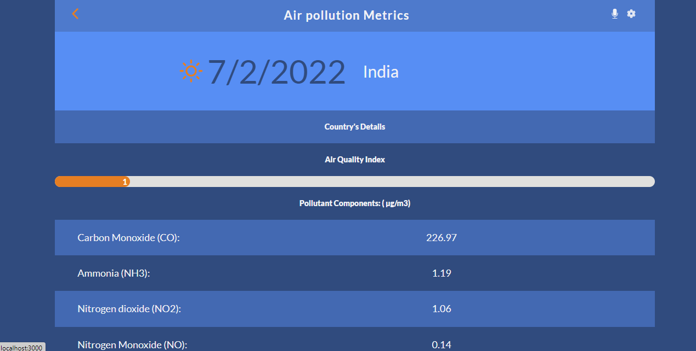
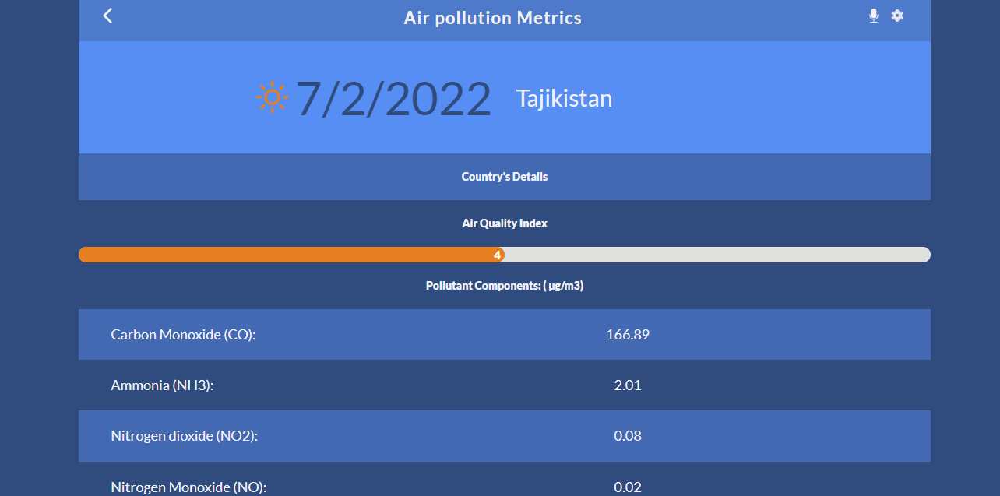

## Air Pollution App

- Air Pollution Metrics app provides current, forecast and historical air pollution data for any coordinates on the globe, users can search by region(continent) or Country to get Metrics update in real time.

### Reigon

### Country Metrics

## Built With

- React
- Redux
- Linters
- APIs

## Live Demo

[video demo]('https://www.loom.com/share/084836369797419eb3f51274a58183b9');
https://www.loom.com/share/084836369797419eb3f51274a58183b9

[Live website]('');

## Getting Started

**This will be included in our portfolio**

To get a local copy up and running follow these simple example steps.

### Step 1:

Go to the repo (https://github.com/kinginthenorthcodez/Air-pollution-metric-app) and click on the <>Code tab.

### Step 2:

Below the <>Code tab, it will be a button that allows you to choose any of the branches of the repository you're interested in (it is commonly set by default to the "master" or "main" branch). Each branch may contain different files and changes to the repo. If you are not sure which one to choose, select the "master" branch.

### Step 3:

Go and click on the right green button with the "code" tag. Be sure to copy any of the https or the SSH links.

### Step 4:

Open the terminal in your computer. To do that, you need to type in the search bar "cmd" for Windows or "terminal" if you are using Línux or macOS.

### Step 5:

Go to the directory where you want to "pull" (download) the repo. If it doesn't exist, create it. Example: cd Documents/Microverse/Module_1/. You can create a folder manually and then go to it in the terminal using the cd command.

### Step 6:

Once you get into your directory, type in the terminal: git clone https or git clone SSH, and then press enter. Example: git clone https://github.com/kinginthenorthcodez/Air-pollution-metric-app

### Step 7:

npm i -g npm@latest to resolve any version dependecy
Ready to work?⛏️ You're all set to explore and change the repo locally (on your computer).

## Authors

👤 **Isaac Maqueen**

- GitHub: [@kinginthenorthcodez](https://github.com/kinginthenorthcodez)
- Twitter: [@kinthenorthcode](https://twitter.com/kinthenorthcode)

## 🤝 Contributing

Contributions, issues, and feature requests are welcome!

Feel free to check the [issues page](https://github.com/kinginthenorthcodez/Air-pollution-metric-app/issues)

## Show your support

Give a ⭐️ if you like this project!

## Acknowledgments

- Stackoverflow!!!
- Inspiration.
- etc.

## 📝 License

This project is [MIT](./MIT.md) licensed.
